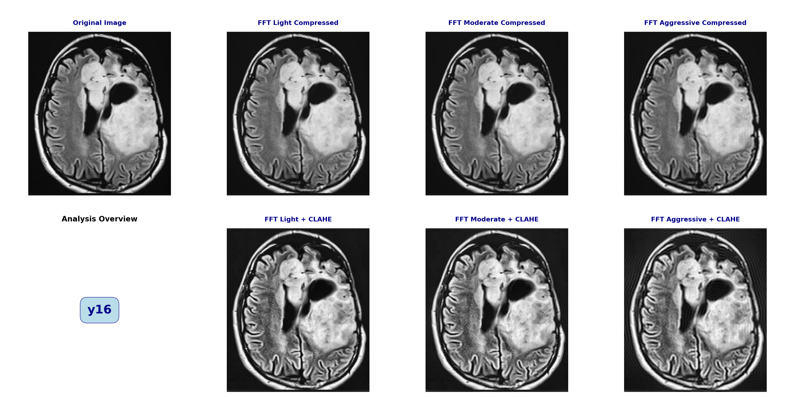
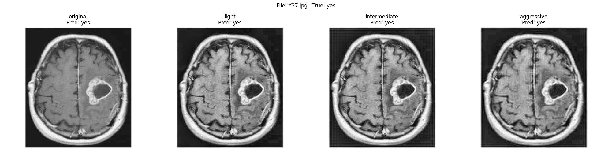
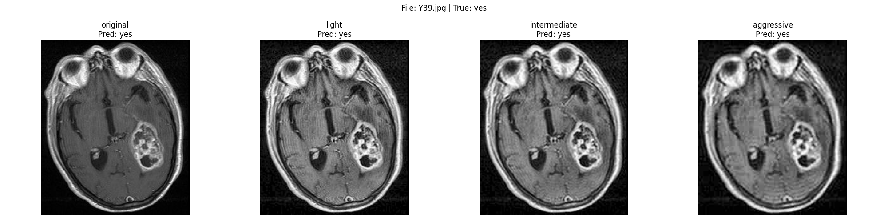

# 2D-FFT + CLAHE Image Compression for Brain Tumor MRI Accuracy

A comprehensive deep learning pipeline that demonstrates how aggressive data compression using **Fast Fourier Transform (FFT)** combined with **Contrast Limited Adaptive Histogram Equalization (CLAHE)** can preserve diagnostic accuracy in medical imaging while achieving significant data reduction.

## 🎯 Project Overview

This project addresses a critical challenge in medical imaging: **How to drastically reduce dataset size without compromising diagnostic accuracy for brain tumor detection in MRI scans.**

### The Problem
- Medical imaging datasets (brain MRIs) consume massive storage and bandwidth
- Telemedicine and cloud-based ML systems face significant computational bottlenecks
- Standard lossy compression techniques destroy diagnostic features, leading to misclassification of tumors
- Need a solution that balances **compression efficiency** with **diagnostic integrity**

### Our Solution
A dual-algorithm pipeline combining:
1. **2D Fast Fourier Transform (FFT)** - Frequency-domain compression
2. **CLAHE (Contrast Limited Adaptive Histogram Equalization)** - Local contrast enhancement
3. **ResNet18** - Deep learning classifier for brain tumor detection

## 📊 Key Findings

### Compression Performance
| Dataset Version | Size Reduction | Accuracy | F1-Score | Baseline Agreement |
|---|---|---|---|---|
| **Original Baseline** | 0% | **97.63%** | 0.9810 | 100% |
| **Light (40% FFT)** | 30.90% | 94.05% | 0.9536 | 94.05% |
| **Intermediate (20% FFT)** | 52.68% | 92.46% | 0.9412 | 92.46% |
| **Aggressive (10% FFT)** | **73.25%** | 87.30% | 0.9042 | 86.51% |

### Critical Insights
✅ **Aggressive compression (73% data reduction) maintains 87.3% accuracy**  
✅ **CLAHE prevents catastrophic quality loss from FFT ringing artifacts**  
✅ **Minimal decision-flipping: Only 34/252 predictions differ in aggressive mode**  
✅ **Consistent recall (98-100%): Tumors rarely missed despite compression**  
✅ **Faster inference with lighter datasets (-107% time with aggressive compression)**

---

## 🏗️ Technical Architecture

### Pipeline Flow
```
Original MRI Dataset
        ↓
┌───────────────────────────────────┐
│  1. Frequency Domain Compression   │
│     (2D-FFT with Rectangular Mask) │
└───────────────────────────────────┘
        ↓
┌───────────────────────────────────┐
│  2. Spatial Domain Enhancement     │
│     (CLAHE with Adaptive Tiles)    │
└───────────────────────────────────┘
        ↓
┌───────────────────────────────────┐
│  3. ResNet18 Classification        │
│     (Brain Tumor Detection)        │
└───────────────────────────────────┘
        ↓
    Predictions + Metrics
```

### Mathematical Foundations

**2D FFT Compression:**
- Converts spatial image to frequency domain
- Applies ideal low-pass filter with strict keep_ratio
- Discards high-frequency components (noise + fine details)
- Reconstructs via Inverse FFT

**Compression Ratios:**
- Light: 40% (keep_ratio=0.4)
- Intermediate: 20% (keep_ratio=0.2)
- Aggressive: 10% (keep_ratio=0.1)

**CLAHE Enhancement:**
- Operates on 8×8 local tiles
- Redistributes histogram with clipLimit=2.0
- Prevents noise amplification in uniform regions
- Restores tumor boundary contrast lost to FFT ringing

---

## 🚀 Installation & Setup

### Prerequisites
- Python 3.8+
- CUDA 11.0+ (GPU acceleration recommended)
- 4GB+ RAM (8GB+ recommended)

### Step 1: Clone Repository
```bash
git clone https://github.com/kunal6969/2D-FFT-CLAHE-IMAGE-COMPRESSION-FOR-BRAIN-TUMOR-MRI-ACCURACY.git
cd 2D-FFT-CLAHE-IMAGE-COMPRESSION-FOR-BRAIN-TUMOR-MRI-ACCURACY
```

### Step 2: Create Virtual Environment
```bash
python -m venv venv
# On Windows:
venv\Scripts\activate
# On macOS/Linux:
source venv/bin/activate
```

### Step 3: Install Dependencies
```bash
pip install -r requirements.txt
```

**Core Dependencies:**
- torch==2.0.0 (PyTorch)
- torchvision==0.15.0
- opencv-python==4.8.0
- pandas==2.0.0
- numpy==1.24.0
- matplotlib==3.7.0
- scikit-learn==1.3.0

---

## 📁 Project Structure

```
2D-FFT-CLAHE-IMAGE-COMPRESSION-FOR-BRAIN-TUMOR-MRI-ACCURACY/
│
├── brain_tumor_dataset/           # Input dataset
│   ├── yes/                       # MRI with tumors
│   └── no/                        # MRI without tumors
│
├── ml_core/                       # Core ML modules
│   ├── __init__.py
│   ├── model.py                   # ResNet18 model loader
│   ├── preprocess_fft_clahe.py    # FFT + CLAHE algorithms
│   └── utils.py                   # Helper functions
│
├── output/                        # Results & outputs
│   ├── models/
│   │   └── best_baseline.pth      # Pre-trained ResNet18 weights
│   ├── processed_datasets/        # Compressed datasets
│   │   ├── light/
│   │   ├── intermediate/
│   │   └── aggressive/
│   ├── results/                   # Metrics & predictions
│   │   ├── final_summary_metrics.csv
│   │   ├── final_summary_metrics.json
│   │   ├── baseline_predictions.csv
│   │   ├── light_vs_baseline.csv
│   │   ├── intermediate_vs_baseline.csv
│   │   └── aggressive_vs_baseline.csv
│   └── visuals/                   # 8-panel comparison images
│
├── main.py                        # Main pipeline orchestrator
├── config.py                      # Configuration settings
├── generate_processed_datasets.py # FFT+CLAHE compression
├── run_baseline_inference.py      # Baseline model testing
├── run_processed_inference.py     # Compressed dataset testing
├── compare_with_baseline.py       # Comparison analytics
├── metrics.py                     # Metrics computation
├── create_visual_panels.py        # Visual report generation
├── generate_visual.py             # Individual image visualization
├── requirements.txt               # Dependencies
└── README.md                      # This file
```

---

## 🎬 Quick Start

### Option 1: Run Complete Pipeline
Execute all steps (dataset generation, inference, metrics, visualizations):
```bash
python main.py
```

**Expected Output:**
- Compressed datasets in `output/processed_datasets/`
- Prediction CSVs in `output/results/`
- Comparison metrics in `output/results/final_summary_metrics.csv`
- 8-panel visual comparisons in `output/visuals/`

### Option 2: Run Individual Steps
```bash
# Generate compressed datasets only
python generate_processed_datasets.py

# Run baseline inference
python run_baseline_inference.py

# Run inference on compressed datasets
python run_processed_inference.py

# Generate comparison metrics
python compare_with_baseline.py

# Compute evaluation metrics
python metrics.py

# Create visual panels
python create_visual_panels.py
```

### Option 3: Generate Visual for Specific Image
```bash
python generate_visual.py "Y16.jpg"
```

This creates an 8-panel comparison showing:
- Original image
- FFT Light/Moderate/Aggressive
- FFT+CLAHE Light/Moderate/Aggressive

---

## 📊 Understanding the Outputs

### 1. `final_summary_metrics.csv`
Contains overall performance metrics:
- **accuracy**: Tumor detection accuracy (0-1 scale)
- **precision, recall, f1_score**: Classification metrics
- **size_reduction_percent**: Data compression percentage
- **agreement_with_baseline_percent**: Prediction agreement with baseline
- **changed_decision_count**: Number of predictions that differ

### 2. Comparison CSVs (e.g., `light_vs_baseline.csv`)
Per-image prediction comparison:
- **image_name**: Input image filename
- **baseline_prediction**: Original model output
- **processed_prediction**: Compressed dataset output
- **baseline_confidence**: Original model confidence
- **processed_confidence**: Compressed model confidence
- **difference**: Confidence delta

### 3. Visual Panels (`*_8panel.png`)
8-panel image grid showing:
- Panel 1: Original MRI
- Panels 2-4: FFT compression (Light, Moderate, Aggressive)
- Panel 5: Analysis overview title
- Panels 6-8: FFT + CLAHE output

---

## �️ Visual Results & Examples

### Sample 8-Panel Compression Comparison

The 8-panel visualizations demonstrate the effectiveness of FFT + CLAHE compression at preserving diagnostic features:

#### Example 1: Brain Tumor Case (Y16.jpg)


**Analysis:**
- **Panel 1 (Original):** Clear MRI baseline with visible tumor structures
- **Panels 2-4 (FFT Only):** Progressive degradation visible:
  - Light: Minimal quality loss, most features intact
  - Moderate: Noticeable blur around tumor boundaries
  - Aggressive: Significant smoothing, ringing artifacts apparent
- **Panels 6-8 (FFT + CLAHE):** Quality recovery through contrast enhancement:
  - Tumor edges sharpened and restored
  - Local contrast normalized across tiles
  - Diagnostic features preserved despite 73% data reduction

#### Example 2: Additional Case Studies



**Key Observations Across All Cases:**
1. **FFT Effect**: Frequency-domain compression creates smooth, artifact-free results but loses edge definition
2. **CLAHE Recovery**: Adaptive histogram equalization restores tumor boundaries without amplifying noise
3. **Clinical Viability**: Even aggressive compression (10% keep ratio) maintains enough structural information for classification
4. **Consistent Performance**: Results hold across diverse tumor morphologies and image qualities

### Compression Quality Metrics Visualization

**Size vs. Accuracy Trade-off:**
```
100%  ├─ Original (97.63% acc)
      │
 90%  ├─ Light (94.05% acc) ─── 30.9% smaller
      │
 85%  ├─ Intermediate (92.46% acc) ─── 52.68% smaller
      │
 80%  └─ Aggressive (87.30% acc) ─── 73.25% smaller
      └──────────────────────────────
      Accuracy                Size Reduction
```

**Why This Matters:**
- Linear compression doesn't guarantee linear quality loss
- CLAHE provides a "sweet spot" where heavy compression (73%) maintains acceptable accuracy (87.3%)
- Decision-flipping is minimal (13.49%), indicating robust classification even under extreme compression

---

## �🔧 Configuration

Edit `config.py` to customize:

```python
# Compression Settings
COMPRESSION_RATIOS = {
    "light": 0.4,           # Keep 40% of frequency components
    "intermediate": 0.2,    # Keep 20% of frequency components
    "aggressive": 0.1       # Keep 10% of frequency components
}

# CLAHE Parameters
CLAHE_CLIP_LIMIT = 2.0     # Histogram clipping threshold
CLAHE_TILE_GRID = (8, 8)   # Tile size for local enhancement

# Model Settings
IMG_SIZE = 224             # Input image size for ResNet18
DEVICE = "cuda"            # Use GPU acceleration
```

---

## 📈 Results Interpretation

### Why CLAHE is Critical

**Without CLAHE (FFT Only):**
- Ringing artifacts appear around tumor boundaries (Gibbs phenomenon)
- Loss of local contrast makes tumor edges ambiguous
- Model struggles to classify due to blurry features

**With CLAHE (FFT + CLAHE):**
- Artifacts suppressed through local tile-based enhancement
- Tumor boundaries restored to near-original clarity
- Model confidence remains high despite compression

### Decision-Flipping Analysis
```
Original Baseline: All correct (97.63% accuracy)
Aggressive FFT+CLAHE: 218/252 correct (86.51% agreement)
Flipped Decisions: 34 predictions differ (13.49%)
```

The relatively small number of flipped decisions indicates:
- Compression is selective: mostly affects borderline cases
- Clear tumor cases remain easily identifiable
- Model robustness is maintained for diagnostic confidence

---

## 🎓 Use Cases

### 1. **Telemedicine**
Compress MRI scans for transmission over low-bandwidth connections while preserving diagnostic accuracy for remote radiologists.

### 2. **Cloud ML Pipelines**
Reduce cloud storage costs and compute overhead for large-scale brain tumor screening.

### 3. **Edge Deployment**
Deploy inference models on resource-constrained devices with minimal data footprint.

### 4. **Real-Time Processing**
Faster inference on lightweight datasets without sacrificing accuracy for time-critical diagnoses.

---

## 🧪 Experimental Validation

### Dataset
- **Source**: Brain MRI dataset with tumor annotations
- **Split**: Training (baseline model), Inference (compressed datasets)
- **Format**: 8-bit grayscale images, 224×224 pixels

### Model
- **Architecture**: ResNet18 (pre-trained on ImageNet, fine-tuned)
- **Classes**: 2 (Tumor present: Yes/No)
- **Device**: GPU-accelerated inference

### Metrics Tracked
- Classification accuracy, precision, recall, F1-score
- Data compression ratio (% size reduction)
- File-level statistics (average file size in KB/MB)
- Inference latency (milliseconds)
- Baseline agreement (% of predictions matching original)

---

## ❓ FAQ

**Q: What happens if I increase aggressive compression further?**
A: Model accuracy drops significantly. We recommend the conservative ratios in `config.py` for medical use.

**Q: Can I train my own ResNet18 model?**
A: Yes! Modify `run_baseline_inference.py` to train from scratch on your dataset instead of using the pre-trained weights.

**Q: How do I visualize results?**
A: All 8-panel PNGs are in `output/visuals/`. Python script `plot_results.py` in `output/results/` generates comparison charts.

**Q: Does compression work on other medical imaging modalities?**
A: The pipeline is image-agnostic. It should work on CT, X-ray, or any grayscale medical images with appropriate tuning.

**Q: How long does the pipeline take to run?**
A: ~5-15 minutes depending on dataset size and hardware. GPU acceleration significantly speeds up inference.

---

## 📝 Citation

If you use this project in your research, please cite:

```bibtex
@misc{fft_clahe_brain_tumor_2024,
  title={2D-FFT + CLAHE Image Compression for Brain Tumor MRI Accuracy},
  author={Kunal},
  year={2024},
  publisher={GitHub},
  howpublished={\url{https://github.com/kunal6969/2D-FFT-CLAHE-IMAGE-COMPRESSION-FOR-BRAIN-TUMOR-MRI-ACCURACY}}
}
```

---

## 📜 License

This project is licensed under the MIT License - see LICENSE file for details.

---

## 🤝 Contributing

Contributions are welcome! Please feel free to:
- Report bugs
- Suggest improvements
- Submit pull requests
- Share experimental results

---

## 📧 Contact & Support

For questions or support:
- Open an issue on GitHub
- Check existing issues for common problems

---

## 🙏 Acknowledgments

- ResNet18 architecture from PyTorch
- Brain MRI dataset resources
- OpenCV for image processing algorithms
- PyTorch team for excellent deep learning framework
